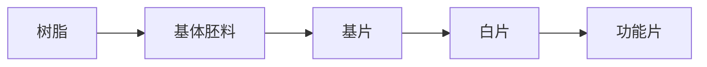

# 概述
- 历史发展
- 
- 行业挑战与机遇

##

### 工艺路线

```mermaid
graph LR
  A[树脂] --> B[基体胚料] --> E[基片] --> C[白片] --> D[功能片]
```
镜片厂
- 基体胚料
- 基片
- 白片
- 功能片

镜片厂/分销/末端
- 白片
- 功能片

功能片
- 染色片
- 复合片
- 

### 分销体系
多级流通分销
终端加工+交付